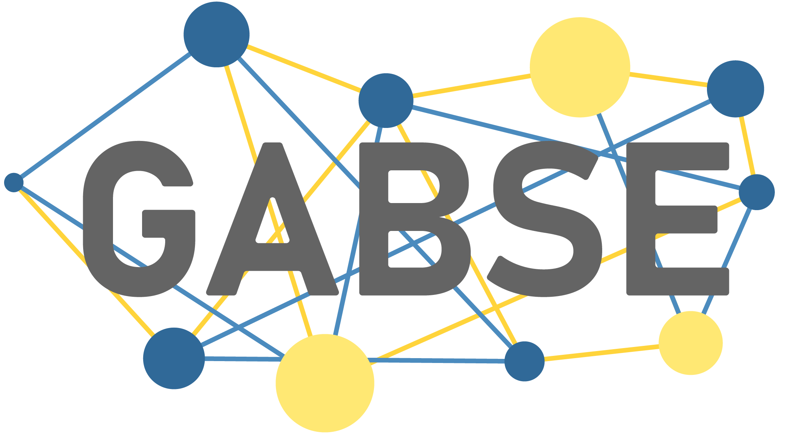

# GABSE



This is the GABSE (Generic Agent-Based Simulation Engine) framework. It provides classes and methods for
creating and managing simulations involving agents, their actions, sensors, and the simulation context. It is based on
an agent-based modeling technique and is developed with the intention of being lightweight, scalable, and flexible.
This package provides the engine, action scheduling, generic agent functionality, and tools for sensory data collection
and management.

## Installation

GABSE can be installed from PyPi using pip.

Installation:

```
pip install gabse
```

Update:

```
pip install gabse --upgrade
```

Uninstall:

```
pip uninstall gabse
```

You can find the GABSE at both PyPi and TestPyPi using these links:

```
https://pypi.org/project/gabse/
https://test.pypi.org/project/gabse/
```

### Dependencies

GABSE has the following dependencies

- sortedcontainers
- numpy
- scipy

## Funactionality

The GABSE framework was developed to be tailored towards the engineering discipline in the sense that there are, beyond
those that are fundamental for Agent-Based Modeling, features to simplify and assist the simulation development. This
includes the following features:

- Dynamic action scheduling and management
- Generic agent functionality
- Sensory data collection and management
- Key Performance Indicators (KPIs) collection and management
- Tools for visualization and analysis of simulation results (to be developed in the future)

### Dynamic action scheduling and management

The GABSE framework provides a dynamic action scheduling and management system that allows for flexible and efficient
scheduling of actions for agents in the simulation. This system allows for actions to be scheduled at specific time and
the schedule therefore can be dynamically updated during the simulation, i.e., it does not have a fixed step size. This
allows for more efficient simulations, as actions can be scheduled at the appropriate times without the need for a
fixed time step. The action scheduling and management system is built on top of a priority queue, which allows for
actions occuring at the same tick being sorted nonetheless.

### Generic agent functionality

The GABSE framework provides a generic agent class that can be used as a base class for creating agents in the
simulation. This generic agent class provides a set of common functionalities that can be used by all agents in the
simulation, such as finding neighbouring agents of a specific class, finding the closest agent of a specific class, and
move, either to a specified position or in a specified direction (move vector).

### Sensory data collection and management

There is a Sensor class that can be used to collect sensory data from agents in the simulation. The collection of data
uses the parent agent getters functions (meaning that for a data point to be logged, there must be a getter function
in the parent agent that can be called to retrieve the data). This is the local data collection that takes place
during the simulation.

There is also a global data collection that can be used to collect data from the entire simulation context. This class
is called the DataCollector, and it can be used to collect data from the entire simulation context in two ways. One way
is to manually call the `store_data` method of the DataCollector class at any point during the simulation, this is
favorable if there will be significant changes happening to an agent (such as it getting destroyed) and you want to
store the data. The second way is to use the automatic data collection that is built into the simulation engine. This
is done by setting the `collect_data` attribute of the simulation engine to `True`.

### Key Performance Indicators (KPIs)

In the `DataCollector` class, there is also a functionality for collecting Key Performance Indicators (KPIs) from
either the context or from the agents in the simulation. This is done by defining a KPI function names `get_kpis()` that
returns a dictionary of KPIs. This function can be defined in either the context or in the agents, and the DataCollector
will automatically call this function and store the returned KPIs in the data collection. The results can then be
exported using the `export_kpis` method of the DataCollector class.

### Tools for visualization and analysis of simulation results

This is a placeholder for the future development of tools for visualization and analysis of simulation results.

## User guide

The GABSE framework is designed to be an efficent way to create a Agent-Based Simulation, and therefore it is designed
to be used in a specific way. This section provides a user guide for how to use the GABSE framework to create and run
simulations. FUndamentally, the construction and execution of a simulation using the GABSE framework can be broken down
into four steps:

1. Declare the agents, their behavior, and sensors.
2. Declare the context and its behavior (optional).
3. Create a `Builder` object and use it to set up the simulation, including the simulation engine.
4. Running the simulation and collecting the results.

### Declaring agents, their behavior, and sensors

### Declaring the context and its behavior

### Creating a Builder

To set up a simulation using the GABSE framework, you need to create a `Builder` object and use it to declare the
context, agents, their actions, and sensors. The `Builder` class is also where you *load* your simulation inputs that
you wish to use in your simulation, such as initial positions of agents, parameters for the simulation, and any other
data that you want to use. In other words, the `Builder` class is where you set up your simulation and declare all the
components of your simulation. It should then also have an object which is the `Engine` class, the class that runs the
simulation.

### Running the simulation

Once you have declared and executed your `builder`, you can run the simulation using the `run` method of the  
`Engine` class. This will start the simulation, and it will run until there are no more actions to execute or until a
specified end time is reached. The `run` method takes a `no_arg_out` argument that dictates
whether the method should return any data or not. `no_arg_out` can be set to:

0. No return value, the method will return `None`.
1. Returns the KPIs collected during the simulation (if any) as a dictionary.
2. Returns the KPIs and collected sensory data during the simulation (if any) as a tuple of two dictionaries, the first
   one containing the KPIs and the second one containing the sensory data, both as dictionaries.

A basic example of running a simulation is as follows:

```
# Build the simulation using the Builder class, the arguments are the same as those of the Builder class constructor
sim = Builder(*args)

# Run the simulation with no return value
sim.engine.run()

# Run the simulation and return the KPIs
kpi = sim.engine.run(1)

# Run the simulation and return the KPIs and sensory data
(kpi, repo) = sim.engine.run(2)
```

## Examples

These are some example simulations that can be used for testing and learning how the GABSE framework functions.

- Zombie apocalypse (both 2D and 3D)

## About

This simulation framework was developed based on research conducted at the Department of Mechanical Engineering,
Blekinge Institute of Technology. It has solely been developed by the author of this repository, and is currently in the
early stages of development. The framework is still being developed and improved, and there are many features that are
planned to be added in the future. The framework is open source and is available for anyone to use and contribute to.
If you have any questions or suggestions, please reach out!
